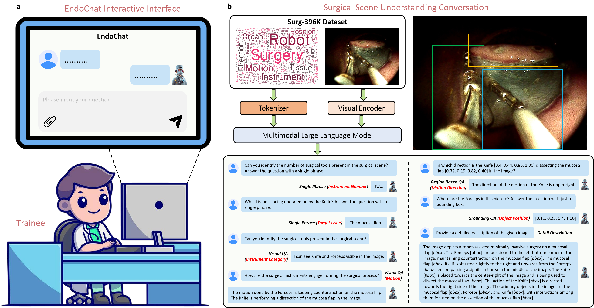

# EndoChat: Grounded Multimodal Large Language Model for Endoscopic Surgery
Guankun Wang†, Long Bai†, Junyi Wang†, Kun Yuan†, Zhen Li, Tianxu Jiang, Xiting He, Jinlin Wu, Zhen Chen, Hongbin Liu, Nicolas Padoy, Nassir Navab, and Hongliang Ren* <br/>

## Overview
Recently, Multimodal Large Language Models (MLLMs) have demonstrated their immense potential in computer-aided diagnosis and decision-making. In the context of robotic-assisted surgery, MLLMs can serve as effective tools for surgical training and guidance. However, there is still a lack of MLLMs specialized for surgical scene understanding in clinical applications. In this work, we introduce EndoChat to address various dialogue paradigms and subtasks in surgical scene understanding that surgeons encounter. To train our EndoChat, we construct the Surg-396K dataset through a novel pipeline that systematically extracts surgical information and generates structured annotations based on collected large-scale endoscopic surgery datasets. Furthermore, we introduce a multi-scale visual token interaction mechanism and a visual contrast-based reasoning mechanism to enhance the model's representation learning and reasoning capabilities. Our model achieves state-of-the-art performance across five dialogue paradigms and eight surgical scene understanding tasks. Additionally, we conduct evaluations with professional surgeons, most of whom provide positive feedback on collaborating with EndoChat. Overall, these results demonstrate that our EndoChat has great potential to significantly advance training and automation in robotic-assisted surgery.
<p align="center">
  
</p>


## Environment Setup(Linux)
### Clone this repository and navigate to the Endochat folder
```bash
git clone https://github.com/gkw0010/EndoChat
cd EndoChat/
```

### Install required packages
1. Basic Setup
```bash
conda create -n endochat python=3.10 -y
conda activate endochat
pip install -r requirements.txt
```
2. Install Flash-Attention(Optional)

If you want to use flash-attention to increase computation efficiency, use the following command:
```bash
pip install flash-attn==2.5.6 --no-build-isolation
```
3. Install LLaMA2-Accessory as Python Packege
```Shell
pip install -e .
```

## Data Download
The Surg-396K dataset can be downloaded through [this link](https://mycuhk-my.sharepoint.com/:f:/g/personal/1155180074_link_cuhk_edu_hk/Eo_sCGxP1ZRKu72NT10fQhkB6Tnrg7qGm-_esKsHMq_I4w?e=oZKldQ).


## Fine-tuning on Surg-396K dataset
To fine-tune the Sphinx-Tiny-1k model on Surg-396K dataset with image size 1024, follow these steps:
1. download the checkpoint from [this link](https://huggingface.co/Alpha-VLLM/LLaMA2-Accessory/tree/main/finetune/mm/SPHINX/SPHINX-Tiny-1k)
2. use the following commands:
```bash
cd accessory/
bash exps/finetune/finetune_ens5_13b.sh
```
Please note that you may need to change the path in ``accessory/configs/data/finetune/train.yaml`` if you encounter a missing file error. 

If you want to use the checkpoint fine-tuned on Surg-396K, you can download it through [this link](https://huggingface.co/jwang01/endochat/tree/main).

## Inference
To run single inference using the fine-tuned model, use the following command:
```Shell
cd accessory/
python inference.py
```

If you want to run batch inference on your own dataset, use the following command:
```Shell
python inference_batch.py \
	--model_id "/path/to/your/model/checkpoint" \
	--test_data_path "/path/to/your/test/data" \
	--result_folder "/path/to/your/result/folder"
```
and see the result in "test_result.json" in result folder.

The Endochat model can be downloaded [here](https://huggingface.co/jwang01/endochat/tree/main).
## Citation

If you find ``EndoChat`` useful for your research or development, please cite the following:

```latex
@article{wang2025endochat,
  title={EndoChat: Grounded Multimodal Large Language Model for Endoscopic Surgery},
  author={Wang, Guankun and Bai, Long and Wang, Junyi and Yuan, Kun and Li, Zhen and Jiang, Tianxu and He, Xiting and Wu, Jinlin and Chen, Zhen and Lei, Zhen and others},
  journal={arXiv preprint arXiv:2501.11347},
  year={2025}
}
```


